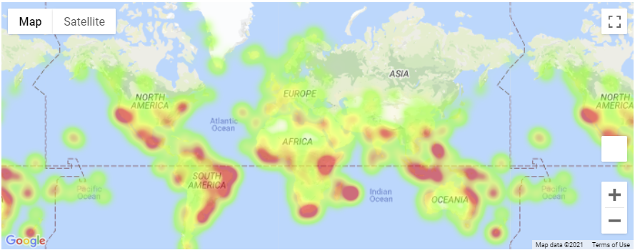
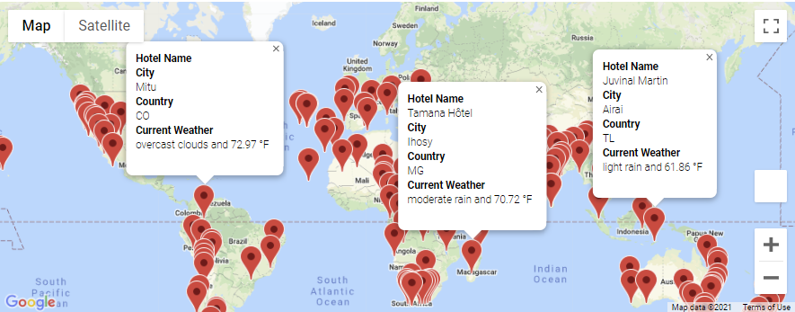
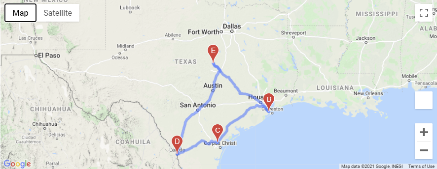

# World_Weather_Analysis

### Overview of analysis performed: 

Analysis was created within Jupyter notebooks. 
- The purpose was to create an app that could be utilized by a travel company to assist customers by selecting the best travel destination based on max temperature parameters set by the customer.
- Once the weather parameters were established:
    - A list of cities was provided along with the nearest lodgings, and the current description of the weather.
- Directions were also provided for possible road trips, if the customer was interested.

##### Description tools used during the project:

* Reading CSVs with pandas
* Using matplotlib.pyplot and SciPy.
* Generating Random latitudes using Random module.
  - randint()
  - random()
  - randrange()
  - uniform()
* Using Citipy to locate the nearest city to latitude and longitude coordinates.
* Using API calls from OpenWeatherMap site and Google Maps.
  - Parsing API responses
  - Creating a dataframe with only the desired data points.
  - Exporting the previously created dataframe as a csv file.
* Using google apis requests.get() function to retrieve the nearest lodgings using 'nearbysearch.'
* Using gmaps to create visualizations, layered visualizations.
  - Heatmaps for weather parameter
  - Directions using coordinates and NumPy
  - Markers using coordinates from a previously created dataframe.
